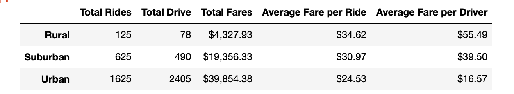

# PyBer_Analysis
## Overview 
### Purpose
I was tasked with summarizing ride-sharing data by city type (urban, subruban, rural) and visualizing this data in a multi-line graph. I completed this by creating a summary DataFrame that showed the total fares by city type and then creating a pivot table from it. I then created a new DataFrame to organize the data by date. This made it possible for me to then create line graphs for each city type to show the trend in total fares over time. 
## Results

Looking at the chart above, across all weeks we can see that sum of Urban fares are higher than both sums of  Suburban and  Rural fares, and the sum of Suburban fares are higher than the total rural fares. This is likely driven by the total rides and total drivers in each city type. Rural cities only have 125 total rides, and 78 total driver giving them the highest average fare per ride. This trend continues when we look at suburban and urban total rides and total drivers the average fare per ride or driver. The more rides and drivers that are available, the lower the average fare is. See below for a visual of this data summarized. 

Additionally the number of rides in comparison to the total drivers plays a role in the pricing. Total rides outnumber total drivers for both Rural and Suburban cities. This makes the price higher. In Urban cities, the total number of rides outnumber the total drivers. 
## Summary of Recommendations
1. We know that consumers are price sensitive, and that the lower the price of a ride, the more likely they will be to use the ridesharing app. As the average fare for a ride in a rural city is $34.62, I suggest finding a way to lower this in order to encourage more people in rural areas to use the app. This can be done through promotional codes and once more people use the app, they will spread the word around increasing the pool of consumers. However, supply would need to match this to keep the price low so there needs to be advertising to encourage more people to sign up to be drivers. 
2. Urban fares are a low price but we can see that the number of rides outnumbers the number of drivers. Perhaps encouraging some of these drivers to do rides in surrounding suburb areas would help drive down the cost of rides as it increases the driver pool. 
3. Finally, I would recommend individuals to share their ride with other in order to cut their price. It would also allow for drivers to make more trips in one day and maximize the amount they make. This would in turn  incentivize them to continue driving and keep a large enough driver supply to drive the cost of rides down. 
